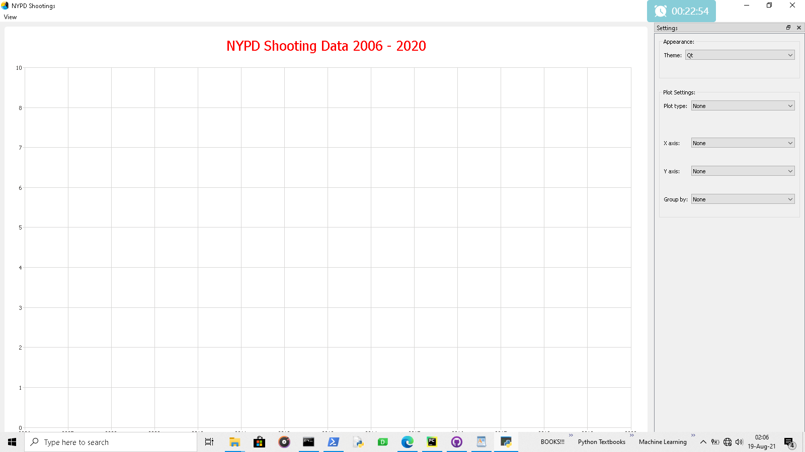
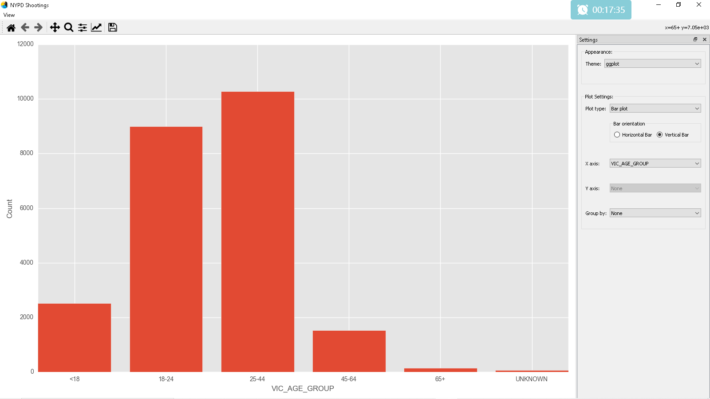
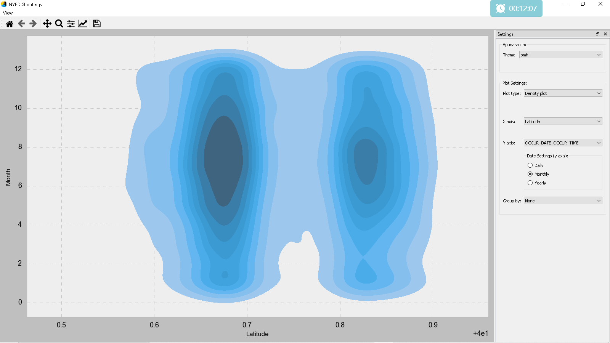
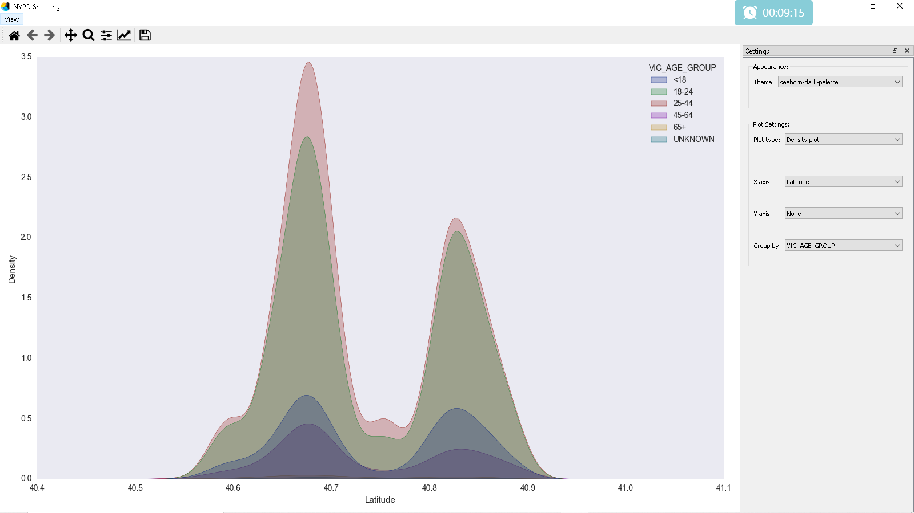
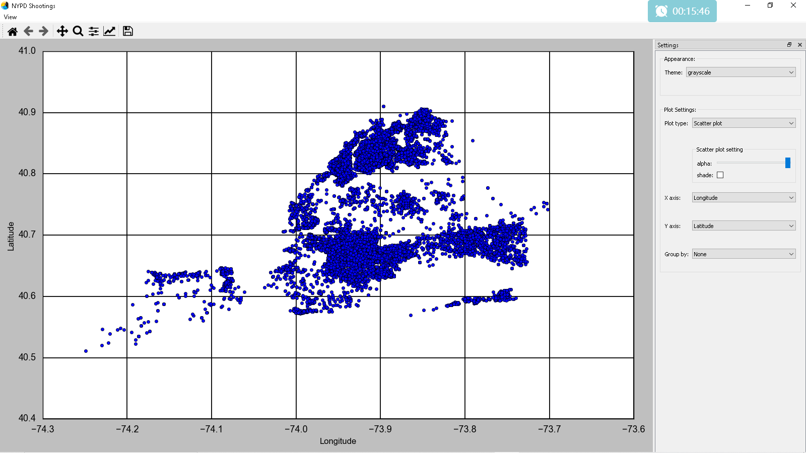
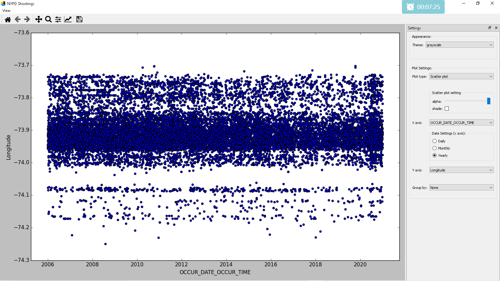

<html>
    <head></head>
    <body>
        <h1 style="color: red; font-weight: bold; font-size:50px; margin: 0">ARE THEY AMONG US?</h1>
        <h2 style="margin: 10px 0;">New York Shooting Incident Data (2006 - 2020)</h2>
        
 
            List of every shooting incident that occurred in NYC going back to 2006 through the end of the previous calendar year.  This is a breakdown of every shooting incident that occurred in NYC
            going back to 2006 through the end of the previous calendar year. This data is manually extracted every quarter and reviewed by the Office of Management Analysis and Planning before being
            posted on the NYPD website. Each record represents a shooting incident in NYC and includes information about the event, the location and time of occurrence. In addition, information related
            to suspect and victim demographics is also included
        

        <h3>Objective</h3>

            This analysis aims to uncover the identities of the shooters, not in terms of their demographics, since that is already known, but in terms of their relationship towards the victims (are they total strangers or someone we know?).
        

        

            With that information in hand, we can somehow guess the reasons behind the shootings thereby taking necessary precautions.This analysis focuses only on women who are victims of shootings, and the "identities" of the shooters who attacks women.
        

        
<i>Data Sources</i>: Usa.data.gov (NYPD_Shooting_Incident_Data__Historic)
        

        

        <h3>Project Arrangement</h3>
        

            In other to encourage further exploration of the dataset to discover more hidden knowledge behind the shootings in New York. I built a desktop Gui application with which to perform various analysis on the dataset.
        

        

            The project contains three folders:
        

        <ul>
            <li>Dataset
                <ul>
                    <li>NYPD_Shooting.csv</li>
                </ul>
            </li>
            <li>Exploratory Data Analysis
                <ul>
                    <li>Shooting Incident in NYPD.ipynb</li>
                </ul>
            </li>
            <li>GUI enabled EDA
                <ul>
                    <li>display_icon.ico</li>
                    <li>interface.ui</li>
                    <li>main.py</li>
                    <li>main_interface.py</li>
                    <li>resources.py</li>
                    <li>resources.qrc</li>
                    <li>utilties.py</li>
                    <li>window_icon.png</li>
                </ul>
            </li>
            The Desktop GUI was developed using PyQt5, 
            matplotlib and seaborn
        </ul>
        <h3>How to run the GUI application</h3>
        

            <ol>
                <li>Download the repository</li>
                <li>Navigate to the GUI enabled EDA folder</li>
                <li>Run the main.py file</li>
            </ol>
        

        <h3>Plot Samples</h3> 
        

            
<b>Default display</b>

             
            
<b>Bar Chart</b>

             
            
<b>Density plots</b>

            
             
            
<b>Scatter plots</b>

            
            
        

    </body>
</html>
